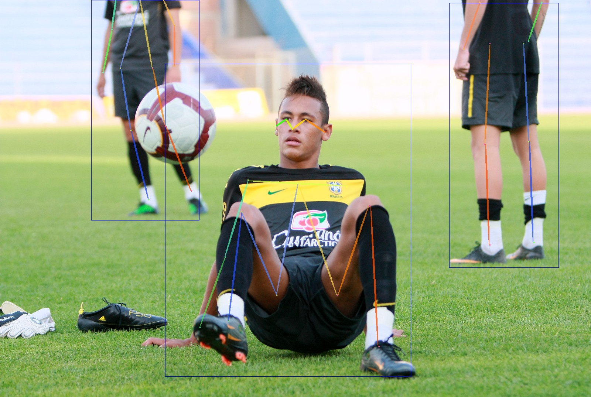
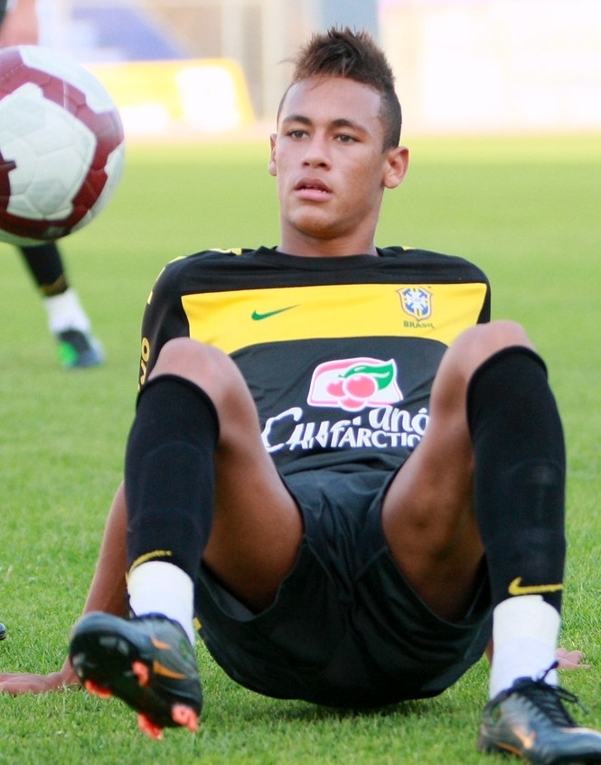
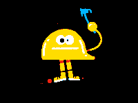
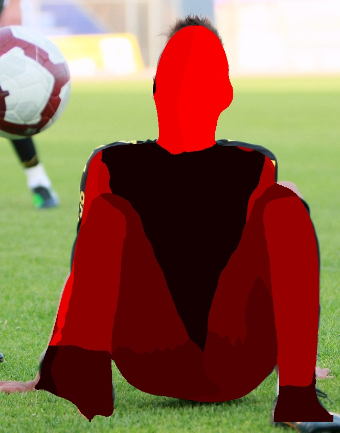
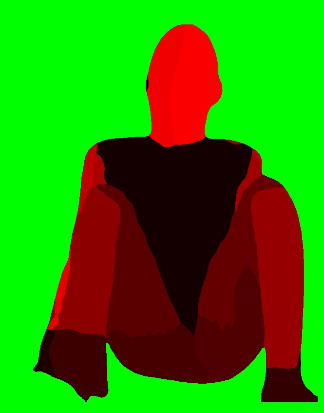
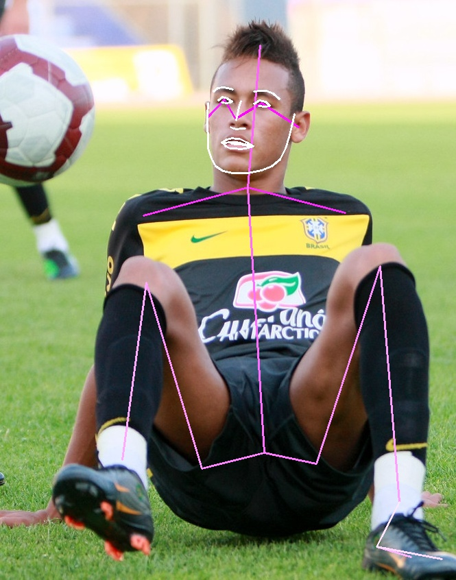
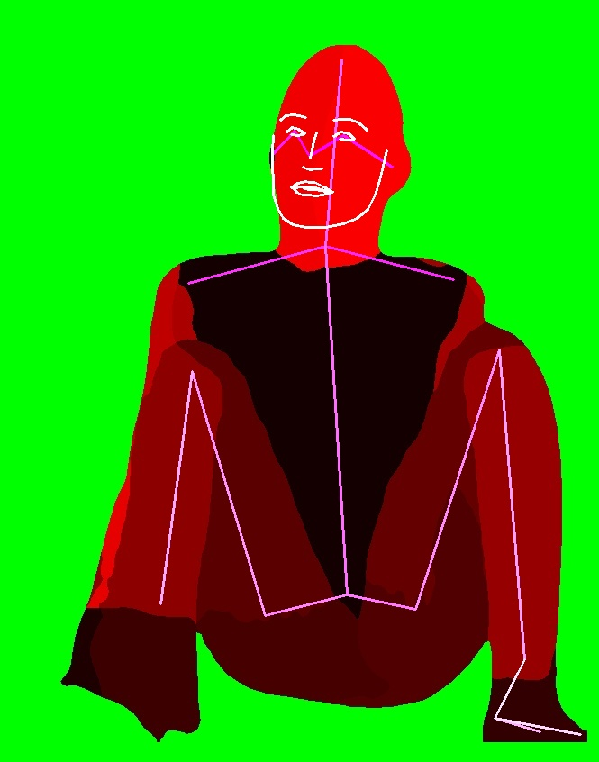
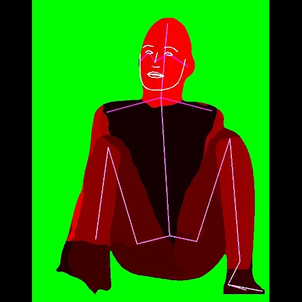

## User Manual
[***Data Loader***](#Data-Loader) \
[***Bbox***](#Bbox) \
[***Resize***](#Resize) \
[***Pose Estimation***](#Pose-Estimation) \
[***DensePose***](#DensePose) \
[***Data managment***](#Data-managment) 

---
To start the program use the file `run.py`\
All the parameters have to be written in the yaml file [configs/config.yaml](../configs/config.yaml). An example of all available option are visible in file [configs/example.yaml](../configs/example.yaml)

Available options are :
- Download of images using flickr
- Resize of images using albumentation
- Crop of images using box prediction with AlphaPose (human detection)
- Pose estimation prediction with AlphaPose (human detection) and draw it on original image, black image or other image
- DensePose estimation with detectron2


---
### Data Loader
Two possibilities:
- Dowload images using flickr_api with argument DATALOADER.TYPE = "FLICKR". You need to generate a personal [flickr key](http://www.cmssupport.utoronto.ca/help/Creating_a_Flickr_API_key.htm) to use it. For more information check [configs/example.yaml](../configs/example.yaml). Images will be saved in ./dataset_name/raw/
- Use your own image base with argument DATALOADER.TYPE = "LOCAL". It must be placed in ./dataset_name/raw/

### Bbox
Using AlphaPose, extract the characters using human detection boxes.
Extracted images will be saved in ./dataset_name/bbox/name_of_input_folder/
Json file and images treated by AlphaPose will be saved in ./dataset_name/bbox/name_of_input_folder_pred/
- Only_one argument aims to extract only one box of the image based on prediction with the biggest area
- Vis_pred argument aims to save json file and images with predictions draw on them compute by AlphaPose visualiser.
- Tresh argument is the minimum confidence value to use to extract box. 
- Min_size_heigth argument is the minimum size of the bbox heigth compare to the input image heigth in percentage.
- Min_size_width argument is the minimum size of the bbox width compare to the input image width in percentage.\
\
[Example of alphapose prediction](../datasets/example/bbox/raw_pred/vis/1.jpg)\
\
[Example of extracted image](../datasets/example/bbox/raw/1_0.jpg)\
\

### DensePose
\
UNDER CONSTRUCTION !!
\
\
[Input image](../datasets/example/bbox/raw/1_0.jpg)\
\
[Prediction draw on input image](../datasets/example/densepose/bbox_raw/rgb/1_0.jpg)\
\
[Prediction draw on green image](../datasets/example/densepose/bbox_raw/green/1_0.jpg)\
\


### Pose Estimation
Using AlphaPose, predict pose estimation of human in the picture.
Generated images will be saved in: **./dataset_name/pose_estimation/name_of_input_folder/[rgb;black;other]**\
Json file and images treated by AlphaPose will be saved in **./dataset_name/pose_estimation/name_of_input_folder_pred/**
- Only_one argument aims to draw only the first prediction made by AlphaPose on images.
- Vis_pred argument aims to save json file and images with predictions draw on them compute by AlphaPose visualiser.
- Save_rgb : draw prediction on the input rgb images and save it in **./dataset_name/pose_estimation/name_of_input_folder/rgb/**
- Save_black : draw prediction on black images and save it in **./dataset_name/pose_estimation/name_of_input_folder/black/**
- Save_other : draw prediction on other images and save it in **./dataset_name/pose_estimation/name_of_input_folder/other/**
- Path_other : path containing other images which are suposed to have the same name and size as input images
- Draw_thickness_lines : argument which defines the thickness of the lines to draw
- Draw_thickness_points : argument which defines the size of the circle to draw at the location of the predicted keypoints
- TRESH: UNDER CONSTRUCTION !!
\
\
[Input image](../datasets/example/bbox/raw/1_0.jpg)\
\
[Prediction draw on input image](../datasets/example/pose_estimation/bbox_raw/rgb/1_0.jpg)\
\
[Prediction draw on other image](../datasets/example/pose_estimation/bbox_raw/other/1_0.jpg)\
\

### Resize
Resize image using albumentation library.
The images are resized without distortion (see example below)
- Size argument aims to declare the final size of the image : new_width x new_heigth
- Interpolation argument aims to choose wich type of interpolation method to use: 0=cv2.INTER_NEAREST, 1=cv2.INTER_LINEAR, 2=cv2.INTER_CUBIC, 3=cv2.INTER_AREA, 4=cv2.INTER_LANCZOS4. **INTER_NEAREST interpolation is usefull for processing label or mask.**\
\
[Image before resize (665x840)](../datasets/example/pose_estimation/bbox_raw/other/1_0.jpg)\
\
[Image after resize (500x500)](../datasets/example/resize/pose_estimation_bbox_raw/other/1_0.jpg)\
\


### Data managment
Example of data management using [configs/example.yaml](../configs/example.yaml). In this example first processing is bbox extraction, following by resize and finaly pose estimation.\
\
**!! Name of output folder depend of previous processing !!**
```
|-- run.py
|-- configs
|   `-- config.yaml
`-- datasets
    `--example
        `-- raw
        |   `-- 0.jpg
        |    -- 1.jpg
        `-- bbox
        |   `-- raw
        |   |   `-- 0_0.jpg
        |   |    -- 1_0.jpg
        |   |    -- ...
        |   `-- raw_pred
        |       `-- alphapose-results.json
        |        -- vis
        |           `-- 0.jpg
        |            -- 1.jpg
        |            -- ...
        `-- densepose
        |   `-- bbox_raw
        |       `-- rgb
        |       |   `-- 0_0.jpg
        |       |    -- 1_0.jpg
        |       |    -- ...
        |       `-- black
        |       |   `-- 0_0.jpg
        |       |    -- 1_0.jpg
        |       |    -- ...
        |       `-- green
        |           `-- 0_0.jpg
        |            -- 1_0.jpg  
        |            -- ...             
        `-- pose_estimation
        |   `-- _bbox_raw
        |       `-- rgb
        |       |   `-- 0_0.jpg
        |       |    -- 0_1.jpg
        |       |    -- ...
        |       `-- black
        |       |   `-- 0_0.jpg
        |       |    -- 0_1.jpg
        |       |    -- ...
        |       `-- other
        |           `-- 0_0.jpg
        |            -- 0_1.jpg
        |            -- ...
        `-- resize
            `-- pose_estimation_bbox_raw
                `--other
                   `-- 0_0.jpg
                    -- 0_1.jpg
                    -- ...
```