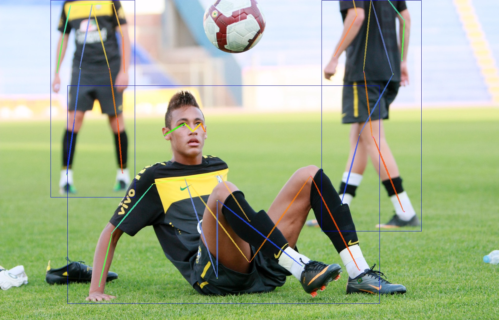
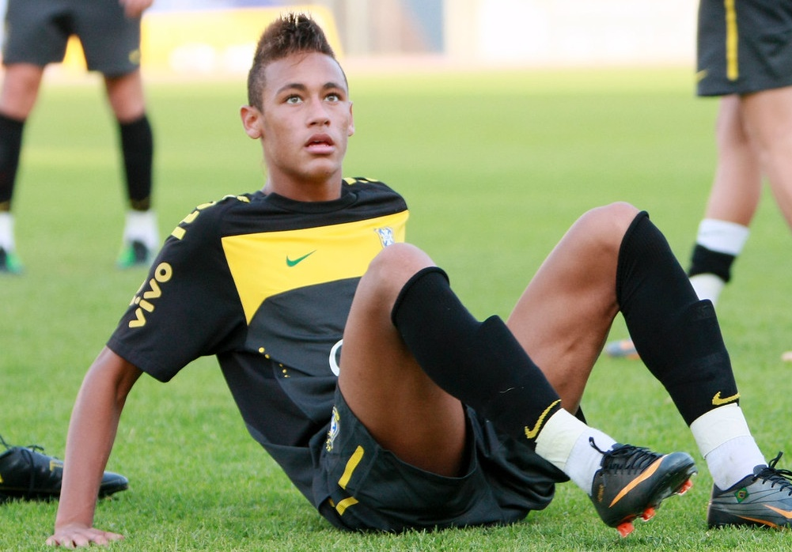
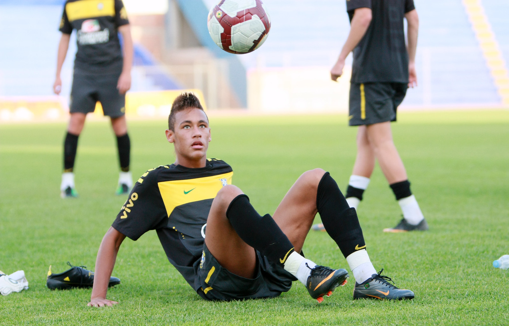
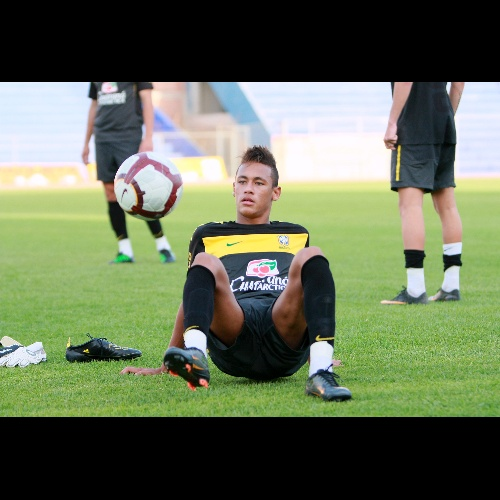
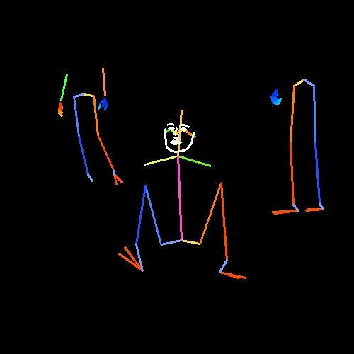

### Requirements
* Nvidia device with CUDA (for AlphaPose)
* Python 3.6+
* Cython
* PyTorch 1.5+
* numpy, matplotlib, open-cv 
* Linux

## User Manual
[***Data Loader***](#Data-Loader) \
[***Bbox***](#Bbox) \
[***Resize***](#Resize) \
[***Pose Estimation***](#Pose-Estimation) \
[***Data managment***](#Data-managment) 

---
To start the program use the file `run.py`

Available options are :
- Download of images using flickr
- Resize of images using albumentation
- Crop of images using box prediction with AlphaPose (human detection)
- Pose estimation prediction with AlphaPose (human detection) and draw it on original image, black image or other image

All the parameters have to be written in the yaml file [configs/config.yaml](../configs/config.yaml). An example of all available option are visible in file [configs/example.yaml](../configs/example.yaml)

---
### Data Loader
Two possibilities:
- Dowload images using flickr_api with argument DATALOADER.TYPE = "FLICKR". You need to generate a personal [flickr key](http://www.cmssupport.utoronto.ca/help/Creating_a_Flickr_API_key.htm) to use it. For more information check [configs/example.yaml](../configs/example.yaml). Images will be saved in ./dataset_name/raw/
- Use your own image base with argument DATALOADER.TYPE = "LOCAL". It must be placed in ./dataset_name/raw/

### Bbox
Using AlphaPose, extract the characters using human detection boxes.
Extracted images will be saved in ./dataset_name/bbox/name_of_input_folder/
Json file and images treated by AlphaPose will be saved in ./dataset_name/bbox/name_of_input_folder_pred/
- Only_one argument aims to extract only the first prediction made by AlphaPose.
- Vis_pred argument aims to save json file and images with predictions draw on them compute by AlphaPose visualiser.
- Tresh argument is the minimum confidence value to use to extract box. 
- Min_size argument is the minimum size of the box to extract compare to the input image in percentage.\
\
[Example of alphapose prediction](image/bbox_vis.jpg)\
\
[Example of extracted image](image/bbox_extract.jpg)\
\

### Resize
Resize image using albumentation library.
The images are resized without distortion (see example below)
- Size argument aims to declare the final size of the image : new_width x new_heigth
- Interpolation argument aims to choose wich type of interpolation method to use: 0=cv2.INTER_NEAREST, 1=cv2.INTER_LINEAR, 2=cv2.INTER_CUBIC, 3=cv2.INTER_AREA, 4=cv2.INTER_LANCZOS4. **INTER_NEAREST interpolation is usefull for processing label or mask.**\
\
[Image before resize (1600x1026)](image/resize_input.jpg)\
\
[Image after resize (500x500)](image/resize_output.jpg)\
\

### Pose Estimation
Using AlphaPose, predict pose estimation of human in the picture.
Generated images will be saved in: **./dataset_name/pose_estimation/name_of_input_folder/[rgb;black;other]**\
Json file and images treated by AlphaPose will be saved in **./dataset_name/pose_estimation/name_of_input_folder_pred/**
- Only_one argument aims to draw only the first prediction made by AlphaPose on images.
- Vis_pred argument aims to save json file and images with predictions draw on them compute by AlphaPose visualiser.
- ...
\
UNDER CONSTRUCTION !!
\
\
[Input image](image/pos_input.jpg)\
\
[Prediction draw on input image](image/pos_rgb.jpg)\
\
[Prediction draw on black image](image/pos_black.jpg)\
\


### Data managment
Example of data management using [configs/example.yaml](../configs/example.yaml). In this example first processing is bbox extraction, following by resize and finaly pose estimation. It is equivalent to folder [dataset-examples](../dataset-examples/1-Foot/)\
\
**!! Name of output folder depend of previous processing !!**
```
|-- run.py
|-- configs
|   `-- config.yaml
`-- datasets
    `-- raw
    |   `-- 0.jpg
    |    -- 1.jpg
    `-- bbox
    |   `-- raw
    |   |   `-- 0_0.jpg
    |   |    -- 0_1.jpg
    |   |    -- 1_0.jpg
    |   |    -- ...
    |   `-- raw_pred
    |       `-- alphapose-results.json
    |        -- vis
    |           `-- 0.jpg
    |            -- 1.jpg
    |            -- ...
    `-- resize
    |   `-- bbox_raw
    |       `-- 0_0.jpg
    |        -- 0_1.jpg
    |        -- 1_0.jpg
    |        -- ...
    `-- pose_estimation
        `-- resize_bbox_raw
        |   `-- rgb
        |   |   `-- 0_0.jpg
        |   |    -- 0_1.jpg
        |   |    -- 1_0.jpg
        |   |    -- ...
        |   `-- black
        |       `-- 0_0.jpg
        |        -- 0_1.jpg
        |        -- 1_0.jpg
        |        -- ...
        `-- resize_bbox_raw_pred
            `-- alphapose-results.json
             -- vis
                `-- 0_0.jpg
                 -- 0_1.jpg
                 -- 1_0.jpg
                 -- ...
```